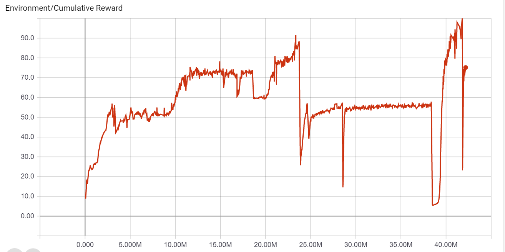
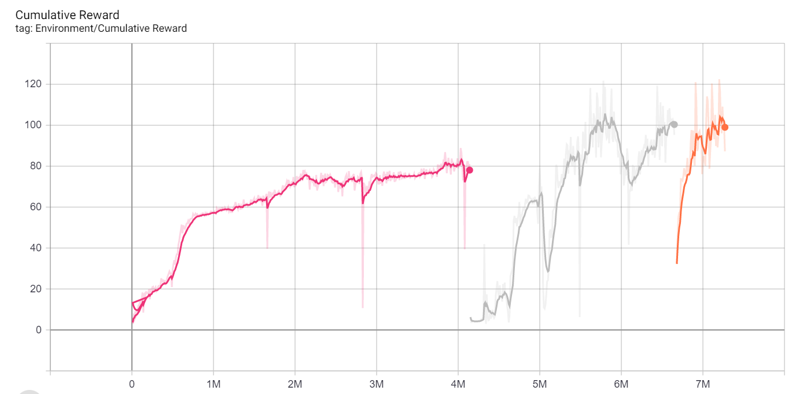

# Kart ML project
this is the final project for ML with unity at IDC fall 2019
 created by:
* Alon Shoa
* Tamir Caspi
## Introduction, Kart-ML
In this project we have taken the unity Karting tutorial
 https://learn.unity.com/project/karting-template
We created a self-racing Karting agent that learned how to complete our custom course. and We implemented ml-agent using the ml-agent toolkit (using the pythonAPI v14) we used  PPO with reinforcement learning for training the kartAgent. 

## Training policy
Our policy for training the kart agent: 
 * Kart speed:
The kart will receive a small reward based on the speed of the agent according to the formula of kart_speed * eps (eps=very_small_number)
 * Check points: 
We created many checkpoints along the track. In a lap in each checkpoint the kart reached we give the agent a strong reward in order to promote the kart along the track to the finishing line. 
 * Walls collision:
We “punish” the agent for hitting the walls by resetting the agent back to the starting line.

## Agent action
We created an agent action space of 3:

 * Acceleration – to control the kart speed
 * Rotation – to control the steering
 * Hopping – to controls hopping for drifting

To learn these actions, we need to give the model some observations of the unity world
we have given the agent:
 * karts speed
 * rotation of the kart
 * Set of ray casts that can see the track. The front 180 ֯ with 4 rays for each side and one straight (total 9)
 * Distance to next checkpoint
For that purpose, we had to implement and integrate some new components.
### Kart components
First, to set the kart as an agent, we need to add a behavior params component to the kart, we need to add an agent component to the kart, and to use the ml model we need to add a decision requester.
We implemented a class KartAgent that inherits from Agent class. The usage of this class is to control the kart via the ml model. 
In this class we implement the actions, observation collection and reward system, as described above. To connect KartAgent as an input to movement of the kart we implemented KartAgent with IInput interface. IInput is the interface for input of the movement. 

### Agent implementation
As the Agent requires, we implemented the following methods:
 * AgentReset() - in this method we moved the Agent to its original position.
 * CollectObservations() – in this method we give the agent the set of observation of the world as described above. 
 * AgentAction(float[] actions) – in this method we implemented the behavior based on the action vector that we received from the model. 
    * Action [0]: is for acceleration, if its positive and above some epsilon it moves forward, if negative less than (-epsilon) it moved backwards. If in-between it does not move.
    * Action [1]: is the rotation of the kart. We give it as is to the steering parameter.
    * Action [2]: is for hopping, if the value is higher than threshold of 0.8 the kart will hop.
 * We also implemented Heuristic () method that uses the keyboard as inputs instead of the using the ml model. This was used to test that the agent action is working, and it can be used for imitation learning. We done some demo recordings for imitation learning but because our implementation of the action space is continues, we didn’t use it in the end. 

## Learning and training process
We tested a few approaches for learning, and we saw that if we train it a lot, we can reach overfitting. In the graph below, after a night run (about ~25M steps) it has overfitted, we can see that when we changed the road at 30 degrees and you can see that the reward got stuck in about 50. In the later phase, in the last period in the graph we changed it back and saw that the reward is increasing. 
 
 

After seeing the above behavior, we understand that changing the degree of the road can be important to not overfit. We tested a few rounds and saw that it can help the training process, as we can see in the below graph.
The first part is training on 0, then 30, then 90. We can see also that it assists the learning duration, we got to ~100 in less than 10M moves were in the previous we got to ~100 in more than 20M steps.

 
## Summary and conclusions
We did several trainings, one that was about ~40M steps and the other was ~10M steps. In both scenarios the agent was able to finish the lap. We saw that adding rotation to the environment can reduce the overfitting of the training. We used 80 karts on a machine with GPU. 
By hand it took us (only 2-3 tries) about 26 sec to finish a lap, for the 10M steps model it took ~23 sec and for the 40M steps it took ~26 sec.

